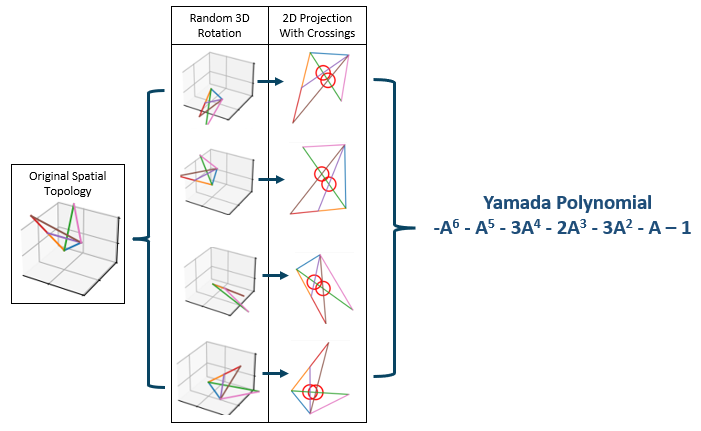

# Yamada: The Python Library for Calculating Yamada Polynomials

TODO: Add a description of the project.

## Publications

## Installation
Yamada is available on PyPI. To install Yamada, run the following command in your terminal:

>pip install yamada

Since this library is still early in development it has not been tested for compatibility across
a large range of environments. If you encounter any issues, please submit an issue on the GitHub.
With that said, it should work on any system that supports Python 3.10.0 or higher.

## Known Issues
1. Some of the input checks and validations are written conservatively. I've noticed the library will occasionally throw 
an error when calculating the Yamada polynomial of a very large spatial topology. The issue
seems to resolve itself when rerunning the program.