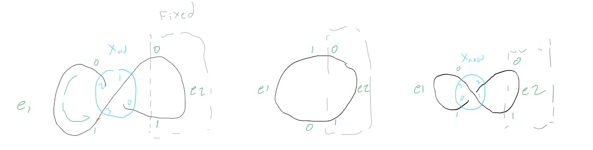

Crossing Swap
=============

# Anti-Reidemeister Moves

## Check one: Unknot-to-unknot

If we take an unknot and twist it to form an infinity symbol then it will have one crossing. If we untwist it, and then twist it in the opposite direction we will also get an infinity symbol with one crossing. Swapping the crossing order should switch between the two. All three should have the unknot Yamada polynomial

.. literalinclude:: ../../../../tests/test_sgd/test_crossing_swap.py
   :language: python
   :lines: 5-15
   :linenos:
   :caption: Example Test Function

## Check two: knot-to-unknot

We define a circle with a figure-eight knot in it. If we apply a crossing swap to the middle crossing, then It should become the unknot. Applying the crossing swap should also make an R2 and then an R1 move possible (which wouldn't affect the Yamada polynomial, but we should make sure that it still is detected and can  be correctly applied)

.. literalinclude:: ../../../../tests/test_sgd/test_crossing_swap.py
   :language: python
   :lines: 5-15
   :linenos:
   :caption: Example Test Function

.. image:: images/knot_to_unknot_crossing_swap.jpg
   :alt: Test result explanation
   :align: center
   :width: 500px